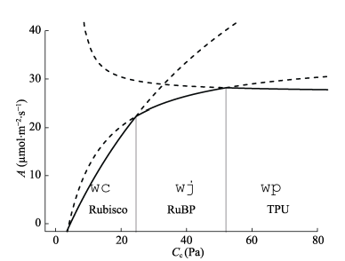

# CO~2~ 响应曲线的拟合 {#response_fit}

## FvCB 模型 {#fvcb_mod}

在 `plantecophys` 包中使用的模型为 @Farquhar1980A 建立的 C3 植物模型 FvCB，其基于 C3 植物碳反应的三个阶段：

* 核酮糖-1,5-双磷酸羧化酶/加氧酶 (Rubisco)的催化下, 核酮糖-1,5-双磷酸(RuBP)与 CO~2~发生羧化作用, 生成3-磷酸甘油酸(PGA)。

* 在腺苷三磷酸(ATP)和还原型烟酰胺腺嘌呤 二核苷酸磷酸(NADPH)的作用下, PGA被还原成磷 酸丙糖(TP)。每6个TP中有1个输出到细胞液中,
用 于蔗糖或者淀粉的合成。

* 剩下的5个TP 在ATP的作用下再生为 3 个RuBP。一部分再生的 RuBP在Rubisco的催化下被氧化成PGA和2-磷酸乙 醇酸,
2-磷酸乙醇酸在ATP的作用下形成PGA, 并且 释放CO~2~ (光呼吸)。

在光照下, C3 植物净光合速率 (A) 取决于 3 个同时存在的速率: RuBP羧化速率(Vc)、RuBP氧化速率 (或光呼吸速率,
Vo)和线粒体在光照下的呼吸速率 (或明呼吸速率, Rd; 此名为了与暗呼吸速率对应和区分)。RuBP氧化过程中每结合1 mol
O~2~ 就会释放 0.5 mol CO~2~ 。因此, 净光合速率 A 的计算为：

```{r, fvcb, out.width='100%', fig.cap = "光合速率的不同的限制阶段", echo = FALSE}

```

\begin{equation}
A\ =V_{c}\ -0.5V_{o}\ -\ R_{d}
(\#eq:aeta)
\end{equation}

线粒体Rd不同于暗呼吸速率(Rn )。Rn是叶片在 黑暗中的线粒体呼吸速率, 随着光照的增加, 线粒体呼吸速率下降。因此 Rd <
Rn 在黑暗条件下测定的叶 片 CO~2~ 交换速率即 Rn , 但是 Rd 的测定比较困难, 因为光照条件下 Rd 与
Vc、Vo 同时存在。@Hikosaka2006Temperature 总结了几种测定
Rd 的方法，式 \@ref(eq:aeta) 又可表达为：

\begin{equation}
A\ =V_{c}\ (1\ -0.5\alpha)\ R_{d}
(\#eq:achange)
\end{equation}

式 \@ref(eq:achange) 中 $\alpha$ 为氧化速率和羧化速率的比值，由 Rubisco 动力学常数确定：

\begin{equation}
\text{\ensuremath{\alpha}\ =\ \ensuremath{\frac{V_{O}}{V_{C}}}\ =\ \ensuremath{\frac{O}{C_{c}}}\ \ensuremath{\times}\ \ensuremath{\frac{V_{omax}\ K_{c}}{V_{cmax}\ K_{o}}}}=\ \frac{O}{C_{c}}\ \times\ \frac{1}{S_{\frac{c}{o}}}
(\#eq:dynamic)
\end{equation}

式 \@ref(eq:dynamic) 中，Cc 和 O 分别为叶绿体部位 CO~2~ 和 O~2~ 浓度。Cc 和
O 通常以气体摩尔分数 ($\mu mol\text{·}mol^{-1}$ ) 或分压 (Pa) 表示, 但光合过程是在叶绿体的液相基质中发生的,
用分压表示更加恰当。Kc 与 Ko 为 Rubisco 羧化(氧化)的米氏常数, 代表了羧化(氧化)速率达到最大羧化(氧化)速率一半时的
CO~2~ 和 $O_{2}$ 浓度。是 Rubisco 特异性因子, $S_{\frac{c}{o}}$表示 Rubisco
对CO~2~ 和 $O_{2}$ 的偏好程度。

当 A = Rd , 即 RuBP 羧化的 CO~2~ 吸收速率刚好 等于 RuBP 氧化的 CO~2~ 释放速率
(Vc = 2Vo ) 时, $\alpha$ = 0.5。此时叶绿体的 CO~2~ 浓度就是叶绿体 CO~2~
光合补偿点, 标记为 $\Gamma^{*}$。即：

\begin{equation}
\Gamma^{*}\ =\ \frac{0.5O}{S_{\frac{c}{o}}}
(\#eq:com)
\end{equation}

由公式 \@ref(eq:dynamic)和公式 \@ref(eq:com)可得：

\begin{equation}
\text{\ensuremath{\alpha}\ =\ \ensuremath{\frac{2\Gamma^{*}}{C_{c}}}}
(\#eq:combine)
\end{equation}

代入公式 \@ref(eq:achange) 得到：

\begin{equation}
A\ =V_{c}\ (1\ -\frac{\Gamma^{*}}{C_{c}})\ R_{d}
(\#eq:combine2)
\end{equation}

在 Cc 浓度很低的时候，RuBP 供应充足 (图 \@ref(fig:fvcb) Rubisco 阶段)，Vc 等于 Rubisco
所能支持的羧化速率 w~c~，：

\begin{equation}
w_{c}\ =\ \frac{V_{cmax\ }C_{c}}{C_{c\ }+\ K_{c\ }(1\ +\ \frac{O}{K_{o}})}
(\#eq:wc)
\end{equation}

随着 Cc 浓度的增加，Rubisco 支持的羧化速率超过了 RuBP 供应速率, Vc 受 RuBP 再生速率的限制（图 \@ref(fig:fvcb)
RuBP 阶段），此时 Vc 由 RuBP 的再生速率限制，而 RuBP 又由电子传递速率（J）决定，故：

\begin{equation}
w_{j}\ =\ \frac{J\ C_{c}}{4C_{c\ }+\ 8\Gamma^{*}}
\end{equation}

当 Cc 浓度很高，光合磷酸化超过了淀粉和蔗糖的合成速率的时候，Vc 受到 TP 利用速率（Vp）的限制（图 \@ref(fig:fvcb)
TPU 阶段），一般情况下，

\begin{equation}
w_{p\ }=\ \frac{3V_{p}C_{c}}{C_{c}-\Gamma^{*}}
\end{equation}

最终，C3 植物叶片的光合速率 A 由 w~c~、w~j~、w~p~
的最小者决定（图 \@ref(fig:fvcb) 实现部分），当c > $\Gamma^{*}$时：

\begin{equation}
A=min\{w_{c},w_{j,}w_{p}\}(1-\frac{\Gamma^{*}}{C_{c}})-R_{d}
\end{equation}

## `plantecophys` 软件包 {#plantecophys}

Remko A. Duursma 在2015年发表了一篇文章 @Duursma2015Plantecophys，`plantecophys` 是其开发的一个R包工具集，用于对叶片气体交换数据进行分析和建模。实现了如下功能：

* CO~2~ 响应曲线 (A-Ci curves) 的拟合、作图及模拟。
* 不同气孔导度模型。 
* 根据 Cowan-Farquhar 的假设估算最适的气孔导度。 
* 耦合气体交换模型的实现。 
* 基于 Ci 模拟 C4 光合。 
* RHtoVPD：常用单位的转换（相对湿度、水汽压亏缺、露点温度）。

各参数的基本用法请参考后文内容，或官方帮助文档:

[plantecophys](https://cran.r-project.org/web/packages/plantecophys/plantecophys.pdf)。

## LI-6400XT CO~2~ 响应曲线的拟合 {#fit6400}

LI-6400XT CO~2~ 响应曲线的拟合需要借助 `plantecophys` 的 `fitaci` 实现，fitaci 函数为根据 FvCB 模型对 A-Ci 曲线的测量数据进行拟合，并估算 J$_{max}$、V$_{cmax}$、R$_{d}$及他们的标准差，并根据
@Medlyn2002Temperature 的方法考虑了温度的影响。

### fitaci 函数介绍 {#fitaci_intro}

`fitaci` 的用法如下^[仅针对 C3 植物]：

```{r eval=FALSE}
fitaci(data, varnames = list(ALEAF = "Photo", 
  Tleaf = "Tleaf", Ci = "Ci", PPFD = "PARi", 
  Rd = "Rd"), Tcorrect = TRUE, Patm = 100, 
  citransition = NULL, quiet = FALSE, 
  startValgrid = TRUE, fitmethod = 
  c("default", "bilinear", "onepoint"), 
  algorithm = "default", fitTPU = FALSE, 
  useRd = FALSE, PPFD = NULL, Tleaf = NULL, 
  alpha = 0.24, theta = 0.85, gmeso = NULL, 
  EaV = 82620.87, EdVC = 0, delsC = 645.1013,
  EaJ = 39676.89, EdVJ = 2e+05, 
  delsJ = 641.3615, GammaStar = NULL, 
  Km = NULL, id = NULL, ...)

## S3 method for class 'acifit'
plot(x, what = c("data", "model", "none"),
     xlim = NULL, ylim = NULL, whichA = c(
       "Ac", "Aj", "Amin", "Ap"), add = FALSE,
pch = 19, addzeroline = TRUE, addlegend = 
  !add, legendbty = "o",transitionpoint = TRUE, 
linecols = c("black", "blue", "red"), lwd = c(1,
2), ...)

```


*主要参数注释：*

* data：需要分析的数据，必须为 data.frame^[具体参考 R 语言相关文档，为 R 语言最常用的数据格式]。
格式。
* varnames：数据的表头，此处函数默认的表头为 LI-6400 的表头，分析 LI-6400 的数据时可以不用填写，直接使用默认的参数即可^[在 R 中，使用参数的值为默认值时可以不用填写该参数，例如使用默认选项分析 LI-6400 数据时，可只填写 data 项，具体参考
R 的相关入门手册]。
* Tcorrect：如果为 TRUE，那么 J$_{max}$、V$_{cmax}$ 的结果为温度校正结果，若 Tcorrect = FALSE，则为测量温度下的结果。
* Patm：为外界大气压。
* citransition：参见详，若提供该选项，则 J$_{max}$、V$_{cmax}$
的区域则分别拟合^[为Rubisco和RuBP限制的Ci转换点，物种间差异较大，可以通过预实验确定]。
* fitmethod：参见详解。
* fitTPU：是否拟合 TPU 限制，默认为 FALSE，参见详解。
* x：对于plot.acifit，x 为fitaci返回的对象，简单理解为 将 fitaci 函数拟合结果赋值给一个变量，此处plot函数实际上为plot.acifit。
* what：利用基础做图工具，默认为对数据和模型进行作图。
* whichA：默认为对所有的光合速率进行作图（Aj=Jmax-limited (蓝色), Ac=Vcmax- limited (红色),
Hyperbolic minimum (黑色)), TPU-limited rate (Ap, 如果模型有计算结果）。

其他参数请参考 FvCB 模型 @Farquhar1980A 或查看 plantecophys 的帮助文档。

#### fitaci函数详解 {#fitaci_detail}

* 默认为非线性拟合，详见 @Duursma2015Plantecophys。
* bilinear 方法使用两次线性拟合方法首先拟合 V$_{cmax}$ 和 R$_{d}$，然后在拟合J$_{max}$，过渡点的选择为对所有数据拟合最适的点，类似 @Gu2010Reliable 的方法。该方法的优势时无论如何，都会返回拟合结果，尤其是非线性拟合失败时使用该方法，但若默认方法失败时，需首先检查是否数据存在问题。两种拟合方法的结果有轻微的差别^[若默认拟合方法失败，数据也无问题，那么是非线性拟合初始值设定的原因]。
* onepoint 参考 @De2016A。
* citransition 使用时，数据将被区分为 V$_{cmax}$ 限制（Ci <
citransition ）区域，以及 J$_{max}$ 限制 (Ci > citransition) 区域。

* fitTPU：如果要计算TPU，要设置 fitTPU = TRUE，并且 fittingmethod
= "bilinear"。但需要注意，当 TPU 被计算时，没有 J$_{max}$ 限制的点的存在是可能的。TPU限制的发生是在A值不随
CO$_{2}$ 的增加而增加时发生的，因此计算 TPU 是否有返回值，取决于测量数据是否有此情况出现。

## 使用 `plantecophys` 拟合 LI-6400XT CO~2~ 响应曲线数据 {#plantecophy_use}

### 数据的前处理 {#data6400}

虽然 R 软件支持直接导入 xlsx 的数据，但因为 LI-6400XT 的数据记录文件内有其他空行或 remark 等内容，增加了处理代码的量，**故而推荐将其数据先整理为如表 \@ref(tab:head6400) 样式，并另存为 csv 格式**^[即仅保留测量值，删除其他所有头文件、空行、 remark 等信息]：


```{r, head6400, echo=FALSE}
style <- read.csv("./data/aci.csv")
knitr::kable(head(style[, 1:8]),  longtable = TRUE, booktabs = TRUE, caption = '推荐 LI-6400 整理后数据样式')
```

### 使用示例 {#fitaci-p}

`plantecophys` 并非 base 的安装包，首次使用需要从 `CRAN` 安装，可以使用图形界面安装，也可以直接用命令行安装^[首次使用安装，更换电脑或者升级 R 软件后，如果没有拷贝 library，也需要运行安装命令]，推荐同时安装依赖。

```{r, eval=FALSE}
install.packages("plantecophys", dependencies = TRUE)
```


```{r, fitaci6400, fig.cap = "光合速率的不同的限制阶段"}
# 载入 plantecophys 
library("plantecophys")

# 利用read.csv读取数据文件，
# 我的路径为当前工作路径的data文件夹内
aci <- read.csv("./data/aci.csv")

# 防止可能出现的NA值
aci <- subset(aci, Obs > 0)

# 不修改默认参数对数据进行拟合
acifit <- fitaci(aci)
# 查看拟合结果的参数名称，方便导出数据使用
attributes(acifit)
# 查看拟合结果
summary(acifit)

acifit_linear <- fitaci(aci,  fitmethod = "bilinear")
summary(acifit_linear)
# 仅查看拟合参数, 比较两种拟合参数的差异
coef(acifit_linear)
coef(acifit)

# 设置作图参数，图形的边距及分为1行两列输出图形
par(mar = c(4.5, 4.5, 2, 2))
par(mfrow = c(1, 2))
# 对两种拟合参数的结果作图，查看模型拟合是否正常
plot(acifit, addlegend = FALSE)
legend(x = 500, y = 10, 
       legend = c(expression(paste(A[c])), 
                expression(paste(A[j])),
                "Limiting rate"),
       lty = c(1, 1, 1),
       col =c("red", "blue", "black") 
         )
mtext(" fitmethod = 'default' ")

plot(acifit_linear, addlegend = FALSE)
legend(x = 500, y = 10, 
       legend = c(expression(paste(A[c])), 
                  expression(paste(A[j])),
                  "Limiting rate"),
       lty = c(1, 1, 1),
       col =c("red", "blue", "black") 
)
mtext("fitmethod = 'bilinear' ")

```

如果需要导出数据做他用，直接根据 `attributes` 中看到的名称，选择对应的数据导出即可，如果使用 Rstudio 的话，其自动补全的功能在选择数据上更方便。例如导出预测值和系数分别使用如下方式：

```{r, eval=FALSE}
# 将模型拟合结果中df（即计算数据）赋给predictaci，
# 并用write.csv导出
predictaci <- acifit$df
write.csv(acifit$df, file = "acipredict.csv")
write.csv(coef(acifit), file = "coefaci.csv")
```

>需要注意的是，因为非线性拟合需要一个初始值，因此，使用默认方式（非线性拟合）的时候，会存在可能的拟合失败现象，此时可以使用 `fitmethod = "bilinear"`，二者结果略有差别。

#### fitmethod = "onepoint" 介绍 {#onepoint}

@De2016A 发表了关于 one point 方法计算 $V_{cmax}$ 和 $J_{max}$ 方法的文章，在 2017 年 11 月的更新中，plantecophys 增加了响应的 R 软件实现方法， 该方法并非使用一个点计算 $V_{cmax}$ 和 $J_{max}$，而是对数据集中的每一个点的值进行估计，使用的方法为逆向了光合作用方程。输出为对每个原始数据加入了 $V_{cmax}$ 和 $J_{max}$，当然一如既往的可以使用温度校准的方法。**并不建议该方法应用于整个 ACi 曲线的数据，它的假设是在外部环境 CO~2~ 浓度和饱和光下，受到 Rubisco 所化速率的限制而不是 RUBP 的限制。**

基于上面的描述，他们的模型如下：

\begin{equation}
\hat{V}_{cmax} = (A_{sat} + R_{day}) \frac{C_i + K_m}{C_i - \Gamma^*} 
(\#eq:inverseA)
\end{equation}

其中：K~m~ 为米氏常数，其计算为：

\begin{equation}
K_m = K_c (1 + \frac{O_i}{K_o}) 
(\#eq:km)
\end{equation}

未知参数均由文献中的方法进行计算，具体可参考 @De2016A 的原文,但上述方法的缺陷为还要使用 ACi 曲线来估算 R~day~，因此作者使用了1.5% V~cmax~ 作为 R~day~，因此公式 \@ref(eq:inverseA) 可变换为：

\begin{equation}
\hat{V}_{cmax} = A_{sat} (\frac{C_i + K_m}{C_i - \Gamma^*} - 0.015)
(\#eq:onepoint)
\end{equation}

另一个重要的模型的假设为 J~max~ 与 V~cmax~ 是成比例的， J~max~ 的计算是通过 C~i~ transition point 来实现的，文章中的比值均值为 1.9，范围在 1.68 ~ 2.14 之间。 

### 使用 'onepoint' 单独计算 V~cmax~ 和 J~max~ {#onpoint_fit}

目前我手头没有相应数据，仅有使用 LI-6400 测试 auto log 2 时的一个数据，我们用这个来示范该方法的使用：

```{r, onepointdata}
one_data <- read.csv("./data/onepoint.csv")
knitr::kable(head(one_data), booktabs = TRUE,
             caption = 'onepoint 使用的数据')
```

数据如上所示，为同一个叶片连续记录数据，故所有的光合速率十分接近。

使用方法：

```{r, onepoint}
library(plantecophys)

one_data <- subset(one_data, Obs > 0)
one_data$Rd <- rep(-0.5, length(one_data$Obs))
aci_fit <- fitaci(one_data, fitmethod = "onepoint")

knitr::kable(head(data.frame(aci_fit$Photo, 
             aci_fit$Vcmax, aci_fit$Jmax)),
             booktabs = TRUE,
             caption = 'onepoint 法计算的结果')
```

需要注意，为保证结果的精确，如果不设定 Rd, 也即文献中的 Rday， 模型是无法计算的，因此上面的示例中虚构了一个，实际操作用一般使用标准的 ACi 测量计算。

### 多条 CO~2~ 响应曲线的拟合 {#multi_curve}

fitacis 函数实际上是 fitaci 函数的扩展，方便一次拟合多条曲线^[需要注意，此时fitmethod一般推荐使用bilinear。]。函数的参数如下：

```{r, eval=FALSE}
fitacis(data, group, fitmethod = c("default", 
        "bilinear"),progressbar = TRUE, 
        quiet = FALSE, id = NULL, ...)

## S3 method for class 'acifits'
plot(x, how = c("manyplots", "oneplot"), 
     highlight = NULL, ylim = NULL, 
     xlim = NULL, add = FALSE, what = c("model",
     "data", "none"), ...)
```

**主要参数详解：**

实际上 fitacis 与 fitaci 模型算法完全一致，只不过增加了一个 group 参数，用于区分不同测量的数据，具体请参考举例内容。

#### fitacis 函数应用举例 {#fitacis_exa}

下文代码根据 plantecophys 中的示例代码修改，进行演示，原代码请参考其帮助文档。

```{r, fitacisr, fig.cap='fitacis作图结果'}
library(plantecophys)
# 只提取前10个不同测量的数据，节省时间进行举例
manyacidat2 <- droplevels(manyacidat[manyacidat$Curve %in% 
                                       levels(manyacidat$Curve)[1:10],])

# 对多条曲线进行拟合，使用bilinear方法，
# 仅仅因为其比非线性拟合节省时间
fits <- fitacis(manyacidat2, group = "Curve", fitmethod="bilinear")

# 拟合结果为list，我们可以只提取第一个的拟合结果
fits[[1]]

# 所有参数均可传递到 plot.acifit，例如：
# 将所有的数据点作图，并将数据点标记为蓝色
par(mar = c(4.5, 4.5, 2, 2))
par(mfrow = c(1, 2))
plot(fits, how="oneplot", what="data", col="blue", addlegend = FALSE)
# 在上图的基础上增加模型拟合的线
plot(fits, how="oneplot", what="data", col="blue", addlegend = FALSE)
plot(fits, how="oneplot", add=TRUE, what="model", lwd=c(1,1), addlegend = FALSE)
# 使用sapply提取拟合结果的RMSE(均方根误差)
rmses <- sapply(fits, "[[", "RMSE")
plot(rmses, type='h', ylab="RMSE", xlab="Curve nr")
# 对最差的拟合结果进行作图
plot(fits[[which.max(rmses)]])
```

可以看出，`fitaci` 和 `fitacis` 用法基本一致，各行代码均已经注释，更详细用法请参函数考帮助。

### `findCiTransition` 函数 {#transition}

计算 CiTransition 的函数，第一点为 Ac & Aj，第二点为 Aj & Ap，并且仅在计算 TPU 的前提下才会有第二点出现。

```{r, eval=FALSE}
findCiTransition(object, ...)
```

参数使用，object 为 fitaci 函数对象，或者整个的 `Photosyn` 函数。
... 为使用 `Photosyn` 时可传递的参数。


## C4 植物光合 {#c4}

之前的部分模型全部为关于 C3 植物的拟合，而 @Caemmerer2000Biochemical 的方法，则是针对
C4 植物的 A-Ci 曲线的实现。

```{r, eval=FALSE}
AciC4(Ci, PPFD = 1500, Tleaf = 25, VPMAX25 = 120, 
      JMAX25 = 400, Vcmax = 60, Vpr = 80, 
      alpha = 0, gbs = 0.003, O2 = 210, 
      x = 0.4, THETA = 0.7, Q10 = 2.3, 
      RD0 = 1, RTEMP = 25, TBELOW = 0, 
      DAYRESP = 1, Q10F = 2, FRM = 0.5, ...)
```

**参数详解**

* Ci：胞间二氧化碳浓度 ($\mu mol\cdot m^{-2}\cdot s^{-1}$)。
* PPFD：光合光量子通量密度 ($\mu mol\cdot m^{-2}\cdot s^{-1}$)。
* Tleaf：叶片温度 (\textcelsius)。
* VPMAX25：PEP 羧化最大速率 ($\mu mol\cdot m^{-2}\cdot s^{-1}$)。
* JMAX25：最大电子传递速率 (\textcelsius))。
* Vcmax：最大羧化速率($\mu mol\cdot m^{-2}\cdot s^{-1}$)。
* Vpr：PEP 再生($\mu mol\cdot m^{-2}\cdot s^{-1}$)。
* alpha：维管束鞘细胞中 PSII 活性的比例。
* gbs：维管束鞘导度 ($mol\cdot m^{-2}\cdot s^{-1}$)。
* O2：叶肉细胞氧气浓度。
* x：电子传递的分配因子。
* THETA：曲角参数。
* Q10：Michaelis-Menten 系数中依赖于温度的参数。
* RD0：基温下的呼吸 ($mol\cdot m^{-2}\cdot s^{-1}$)。
* RTEMP：呼吸的基温(\textcelsius)
* TBELOW：此温度以下呼吸为0。
* DAYRESP：明呼吸和暗呼吸的比值。
* Q10F：呼吸依赖于温度的参数。
* FRM：明呼吸中为叶肉呼吸的比例。

以上参数均来自 @Caemmerer2000Biochemical，括号中的参数值均为默认值，具体应用时请按照实际情况修改。

### C4 植物光合速率的计算 {#c4_sim}

```{r, fig.cap="C4 植物 A-Ci 作图"}
# 模拟 C4 植物的 Ci 值，计算光合速率并作图
library(plantecophys)
aci <- AciC4(Ci=seq(5,600, length=101))
with(aci, plot(Ci, ALEAF, type='l', ylim=c(0,max(ALEAF))))
```

\cleardoublepage


