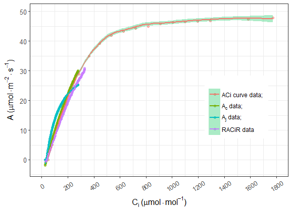

# LI-6800 的数据分析

## 数据格式

LI-6800 的数据前处理同 LI-6400 相同，如表 \@ref(tab:head6800) 所示的样式。

```{r, head6800, echo=FALSE}
style1 <- read.csv("./data/aci6800.csv")
knitr::kable(head(style1[, 1:6]),  longtable = TRUE, booktabs = TRUE, caption = '推荐 LI-6800 整理后数据样式')
```

## LI-6800 与 LI-6400 使用时的差别

`plantecophys` 使用时建立在 LI-6400XT 基础之上的软件包，因此在 LI-6800 代码中，需要改动的是 fitaci、fitacis 及 fitBB 中的 varnames 选项，也就是将 LI-6400XT 的表头改为 LI-6800 的表头。
以 fitaci 函数为例：

```{r, eval=FALSE}
 fitaci(aci, varnames = 
        list(ALEAF = "A", Tleaf = "Tleaf", Ci = "Ci", 
          PPFD  = "Qin", Rd = "Rd"))
```

## 光响应曲线注意事项

光响应曲线的拟合相对简单，仅需要光强和光合速率的值，其中需要修改的部分仅为光强的赋值部分，在文件名一致的前提下，修改如下代码即可：

```{r, eval=FALSE}
lrc_Q <- lrc$Qin
lrc_A <- lrc$A 
```

## LI-6800 RACiR\texttrademark 的测量与拟合

在评估作物性状时，V$_{cmax}$ 及 J$_{max}$时非常有用，传统的 A–Ci 曲线测量要求植物叶片要在一定浓度 CO$_{2}$
下适应几分钟后完成测量，这样的测量有几个缺点：

* 测量时间长，一条曲线至少需要 20 – 30 min，样本量多，重复多时，这种方法几乎没有可行性。
* 整个测量过程中，时间长，酶的激活状态会有变化，叶绿体会移动，气孔的开度也会发生变化。

而 LI-6800 独有的 auto control 功能在算法上允许用户自定义 CO$_{2}$ 的起始浓度和种植浓度、变化方式（线性或其他）、所花费的时间，再加上其
IRGAs 极快的响应频率，使得短时间内的 A–Ci 的测量成为现实，即快速 CO$_{2}$ 响应曲线 RACiR\texttrademark
测量实验，该功能使得 5 min 内测量 A–Ci 曲线成为可能。该方法的实现可参考  @Stinziano2017
的文章。具体测量步骤请参考我们的 LI-6800实验手册。

## RACiR\texttrademark 分析的实现 

```{r, eval=FALSE}
# 分别读取未校准空叶室数据
# 未校准带叶片测量数据
# 标准aci曲线测量数据
uemp500 <- read.csv("./data/uncorr_emp500.csv")
uleaf500 <- read.csv("./data/uncorr_leaf500.csv")
acin <- read.csv("./data/aci_ex.csv")

# 防止读入空白行
m <- length(which(uemp500$obs >= 1))
n <- length(which(uleaf500$obs >= 1))
uemp500 <- uemp500[1:m,]
uleaf500 <- uleaf500[1:n,]

# 观察空叶室未校准数据reference对A的图形
plot(uemp500$CO2_r, uemp500$A)
# 选取线性部分用于校准
locator()
# 执行locator命令后，在上图中的目标位置选点，
# 选好后按 esc 可以返回所选点的坐标（选点即为在
# 预期位置鼠标单击）

# 根据上面的点，利用二氧化碳的值过滤掉不需要的数据
# 只要在线性范围内选点，拟合结果相差很小
cemp <- uemp500[which(uemp500$CO2_r > 
        45.28 & uemp500$CO2_r < 459.12),]
plot(cemp$CO2_r, cemp$A)
x <- lm(A ~ Ci, data = cemp)
summary(x)
# 利用拟合的结果，提取校准用的斜率和截距
x$coefficients

k <- x$coefficients[2]
z <- x$coefficients[1]

# 校准带叶片测量的数据
uleafc <- uleaf500
uleafc$A <- uleafc$A - (k * uleafc$CO2_r + z)
uleafc$Ci <- ((uleafc$gtc - uleafc$E / 2) * uleafc$CO2_s - 
                  uleafc$A) / (uleafc$gtc + uleafc$E / 2)

# 对校准前后的数据进行作图，查看校准效果
plot(uleaf500$CO2_r, uleaf500$A, pch = 2, ylim = c(-20, 40))
points(uleafc$CO2_r, uleafc$A)
locator()
cleaf <- uleafc[which(uleafc$CO2_r > 15.7 & 
                        uleafc$CO2_r < 474.15),]
plot(cleaf$CO2_r, cleaf$A)

# 利用plantecophys拟合标准曲线和racir曲线
library("plantecophys")
acifit <- fitaci(cleaf, varnames = 
    list(ALEAF = "A", Tleaf = "Tleaf", Ci = "Ci", 
    PPFD  = "Qin", Rd = "Rd"), Patm = 84.09)
acifit_normal <- fitaci(acin, varnames = 
     list(ALEAF = "A", Tleaf = "Tleaf", Ci = "Ci", 
     PPFD  = "Qin", Rd = "Rd"), Patm = 84.09)
# 查看拟合数据
summary(acifit)
summary(acifit_normal)
acifit$pars
acifit_normal$pars

# 对快速曲线作图拟合结果进行查看
plot(acifit, linecols = c("green", "blue", "red"))

#### ggplot2 作图
alldata <- data.frame(A = 
      c(acin$A, ddata$Ac, ddata$Aj, cleaf$A), 
      Ci = c(acin$Ci, ddata$Ci, ddata$Ci, cleaf$Ci),
      Atype = c(
        rep("standard Aci curve", length(acin$A)),
        rep("Ac", length(ddata$Ac)), 
        rep("Aj", length(ddata$Aj)),
        rep("A corrected", length(cleaf$A))
                      )
)

alldata$Atype <- factor(alldata$Atype, 
    levels = c("standard Aci curve", 
               "Ac", "Aj", "A corrected"))

library(ggplot2)
p <- ggplot(alldata)
p1 <- p + geom_point(aes(Ci,A, colour = Atype),  alpha = 0.5)

p2 <- p1 + geom_smooth(aes(Ci, A, colour = Atype),
                       method = 'auto') + 
  labs(y=expression(paste("A ", "(", mu, 
          mol%.%m^-2%.%s^-1, ")")), 
       x=expression(paste(C[i], " ",
          "(", mu, mol%.%mol^-1, ")")))

p2 + scale_x_continuous(limits=c(0, 1800),
                        breaks=seq(0, 1800, 200)) +  
  scale_y_continuous(limits=c(-3, 50),
                     breaks=seq(0, 50, 10)) + 
  scale_colour_hue(name="  ", 
                   labels=c('ACi curve data; ', 
                   expression(paste(A[c], ' data; ')), 
                   expression(paste(A[j], ' data; ')), 
                   'RACiR data') 
  ) + theme_set(theme_bw()) +
  theme(axis.text.x  = element_text(size = 10, 
           angle=30, vjust=0.5), 
        axis.text.y = element_text(size = 10),
        axis.title.x = element_text(
          size = 12, face = 'bold'),
        axis.title.y = element_text(
          size = 12, face = 'bold'),
        legend.text.align = 0,
        legend.position = c(0.8, 0.6))
```

最终采用常规方法和 RACiR\texttrademark 方法结果如图 \@ref(fig:racir) 所示，其中 Aj 与 Ac 结果采用 RACiR\texttrademark 计算^[注意，注意数据表头的大小写，此处代码中，为处理数据的方便，我更改了大小写，分析自己的数据时需要注意]。
```{r, racir, out.width='100%', fig.cap = "RACiR 方法与常规结果的比较", echo = FALSE}

```

## LI-6800 荧光数据分析

LI-6800 能够直接提供基本的叶绿素荧光参数，其他参数均可通过这些基本的参数进行计算，计算也较简单，在此不赘述，需要注意的是快相荧光部分的数据，因为分析 ojip 数据的模型有很多，很多都需要复杂的计算，在此我们先将其中较为简单的 jip test 数据分析进行介绍。

### jip test 的实现

LI-6800 增加了 ojip 曲线测量功能，本功能主要是针对测量数据的 jip test 的实现。

### `jiptest` 软件包安装

目前 `jiptest` 暂时放在 github 我的软件仓库内，并没提交 CRAN，因此需要 `devtools` 的支持，然后才能从 github 安装 `jiptest`。

```{r, eval=FALSE}

install.packages("devtools")
library(devtools)
install_github("zhujiedong/jiptest")
```

### `read_files` 及 `read_dcfiles` 函数

`read_files` 用于批量读取所有调制光测量数据，方便用于其他的数据分析。**函数要求所有数据必须是 `xlsx` 格式，并且所有测量数据都保存在同一文件夹内。**，如有其他文件或测量数据则会报错。
`read_dcfiles` 用于批量读取所有连续光测量数据，其他与 `read_dcfiles` 相同。

函数仅有一个参数，即保存数据文件夹的路径，使用如下：

```{r, jipdata}
library(jiptest)
jipdata <- read_files("./data/ojip")
```

```{r, echo=FALSE}
knitr::kable(head(jipdata),  booktabs = TRUE,
caption = 'jiptest 批量导入数据后的样式')
```

```{r, dcjipdata}
dcjipdata <- read_dcfiles("./data/ojip")
```

```{r, echo=FALSE}
knitr::kable(head(dcjipdata),  booktabs = TRUE,
caption = 'jiptest DC 数据批量导入数据后的样式')
```

### `jip_test` 及 `jip_dctest` 函数

 `jiptest` 是 jiptest 的核心函数，用于所有数据的 jip test 分析，函数仅包含两个参数，测量数据的保存文件夹路径，以及分析结果的导出路径，导出路径必须为**已存在的文件夹或磁盘根目录**。
 `jip_dctest` 与 `jip_test` 相似，用于连续光测量数据的分析。
 
```{r, jiptest}
jip_results <- jip_test("./data/ojip", "d:/")
```

```{r, jipres, echo=FALSE}
names(jip_results) <- c("parameters", "data_file1", 
                        "data_file2", "data_file3",
                        "data_file4")
knitr::kable(jip_results,  longtable = TRUE, booktabs = TRUE, 
             caption = 'jiptest 输出的计算参数')
```

```{r, dcjiptest}
dcjip_results <- jip_dctest("./data/ojip", "d:/")
```

```{r, dcjipres, echo=FALSE}
names(dcjip_results) <- c("parameters", "data_file1", 
                        "data_file2", "data_file3",
                        "data_file4")
knitr::kable(dcjip_results,  longtable = TRUE, booktabs = TRUE, 
             caption = 'jiptest DC 数据输出的计算参数')
```

计算参数见表 \@ref(tab:jipres)

### `jip_ggplot` 函数 

`jip_ggplot` 基于 `ggplot2`，用于快速预览所有测量结果的 ojip 曲线。函数仅有一个参数，即保存数据文件夹的路径，使用如下：


```{r, ggplot, fig.cap="ojip 曲线的快速预览"}
jip_ggplot("./data/ojip")
```

ojip 曲线的快速预览如图 \@ref(fig:ggplot)

\cleardoublepage
