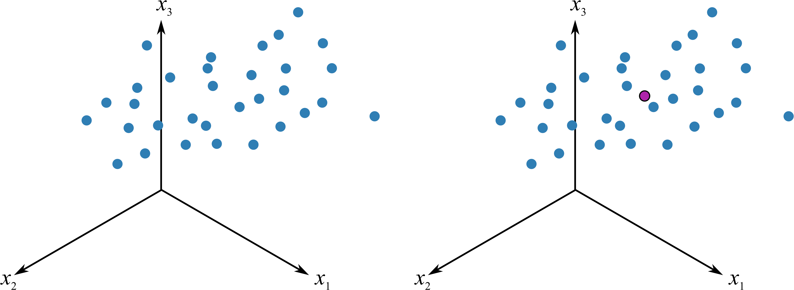

# 大话 PCA {#pca-anylysis}

PCA 作为一个基础的方法，应用领域覆盖很广，涵盖的统计学相关的内容有均值、标准差、协方差， 线性代数中的特征向量及特征值。当然在与光合仪相关的应用方面多数是测量的光合速率、气孔导度等配合植物的其他性状来进行研究，其适用范围，用现在流行的统计学习术语来讲，应属于非监督性学习，即我们并非预测某变量同其预测值的关系，如同我们获得了一系列包含植物光合性状在内的性状，但我们并非将其预测某些结果，如同响应曲线那般，而是用这些形状来分类或者看齐对某目的的重要程度。本章的标题之所以叫大话，是因为这是我结合我自己的理解写的内容，如有错误请谅解，请指出。

另，推荐两个我认为很好的解释 PCA 的链接：

[BioTuring's Blog](https://blog.bioturing.com/2018/06/14/principal-component-analysis-explained-simply/)

[Principal Component Analysis](http://setosa.io/ev/principal-component-analysis/)

## 几何解释 {#geom-pca}

PCA 通常能够反映我们复杂数据集的一些分布特征，例如典型的 `iris` 数据集，我们看到了三个鸢尾种的四个性状：花萼的长宽、花瓣的长宽，如果给我们这么一个数据，我们肉眼很难看出他们的特征来，如果作图也很难表达，因为这是一个四维的数据，假设我们只对前两组也就是花萼的长宽作图，先看一下二维的数据情况：

```{r, 2dim, echo=FALSE}
ggplot2::qplot(log(Sepal.Length), log(Sepal.Width), data = iris)
```

看上去一言难尽，此时的缺点非常明显，图中的每个点均代表了某个植株的两个性状，这个性状类似于我们说的电子云，杂乱而无规律。这还只是二维数据，如果我们将所有四个轴的数据都显示也就是四维的数据，那么对于我等肉眼凡胎来讲，还是不看为妙。

我在看到上面留的两个网址之前，对主成份分析的疑惑一直没断过，什么是主成份，一直说是主轴旋转，到底是怎么旋转的，我们看一下主成份的 PC1 是怎么来做的:

```{r, pccenter, out.width='100%',  echo=FALSE, fig.cap="数据的中心化"}

```

如图 \@ref(fig:pccenter)，假设有三维的数据，可以理解为 iris 数据中前三列的观测值，每个点分别代表了一个植株的前三个性状，PCA 第一步便是中心化，将坐标轴由左边转移到右边的中心点位置作为原点，这就是所谓的平均值中心化的过程，这样就消除了测量时的偏差 ^[https://www.mathsisfun.com/definitions/bias.html]，同时一般还要对数据进行缩放，以消除不同单位的影响 ^[https://en.wikipedia.org/wiki/Scaling_(geometry)]，
例如有光合速率，有叶片面积的数据，这样能够消除不同单位的影响，通常的缩放例如对数化。

```{r, pc2, out.width='100%',  echo=FALSE, fig.cap="PC1 的诞生"}
knitr::include_graphics("images/pc2.png")
```

移动坐标系后，因为进行了缩放，所有的数据具有相同的比例。我们这时做一条最佳的拟合线(图 \@ref(fig:pc2))，此时发生了两件重要的事情：

* 所有的点投影到这条拟合线上，投影后的点之间的距离是最大的，该方向代表了所有变异最大，也就是最大化的区分所有的数据点，因为我们的目的就是要区分数据点之间的差异。如果在读的各位有跟我一样空间想象力有限的，可以根据图 \@ref(fig:maxvar) 的极端情况来理解，蓝色线为最佳拟合线，红色的数据点投影到其上的距离之和当然大于投影到蓝色的拟合线上。

```{r,maxvar, echo=FALSE, fig.cap="变异最大的极端情况"}
plot(1:5, col="red")
lines(1:5, col="blue")
abline(3,0,col="green")
```

* 所有点和他们相对应的点之间的距离是最小的（也就是残差最小，最佳拟合当然是残差最小），这保证了这些投影的点和原来的数据点尽可能接近，也就是变化后损失的信息最少。

以上变化的最终结果为将变异放到最大而误差降低到最小，我们研究的最终目的无非就是这样。这个最佳拟合的线我们将其称之为 PC1，主成份1。

```{r, pc3, out.width='100%',  echo=FALSE, fig.cap="PC2 的诞生"}
knitr::include_graphics("images/pc3.png")
```
如果我们做一条通过中心点并与 PC1 垂直的线，并不断旋转这条线使其满足：所有投影于其上的点，他们的距离最大，也就是变异最大，这样就做出了第二个主成份，PC2，如图 \@ref(fig:pc3)。**就这样不断的变换，一般情况下，我们可以使用 2~3 个主成份来解释绝大部分数据所展示的信息（所有数据都尽可能少的损失信息投影于其上）**。

以上为基本变换，如果我们使用 R 计算 PCA (这里推荐两个包 `factoextra` 和 `FactoMineR`)，查看其结果：
```{r, scree, fig.cap="iris 碎石图"}
library("FactoMineR")
library("factoextra")

ir <- iris[, 1:4]
ir_pca <- PCA(ir, graph = FALSE)

fviz_eig(ir_pca, addlabels = TRUE)
```

我们可以看到，前两个成分可以解释数据 95% 以上的变异，所以我们可以只使用主成份 1 和主成份 2 对我们的结果进行解释。

既然我们使用两个主成份解释整个数据，那么我们怎么把四个性状都放在这个图上呢？这就需要载荷图来展示了，如图 \@ref(fig:loadingpca)

```{r, loadingpca, fig.cap="iris 载荷图"}
fviz_pca_var(ir_pca)
```

怎么解释呢，因为原始的数据点相当于在坐标轴上，这几个性状分布的产生类似于原始的数据点在拉拽某个性状，影响强的偏向某一方向，换句话说，**这些性状决定主成份时有不同的权重，也就是对主成份影响的权重大小。同时他们是有方向的，如果两个性状方向接近，也就是夹角非常小，说明他们有较强的正相关性，例如图中的花瓣的长宽，如果他们互相垂直，那说明他们无相关性，例如图中花萼的长宽，如果夹角非常大，例如他们几乎在一条直线上，说明具有显著的负相关**。其本质还是所有的单位向量（本例有四个性状，各个性状中心化后形成的轴，也就是向量）在现在的这个二维平面的位置。

而如果我想通过这些性状来对鸢尾分类，怎么看呢？那就需要得分图来展示了，如图 \@ref(fig:scorepca) ，得分图本质是各个品种的每个观测值在各个轴上的长度，也就是得分，所以其值都是每个物种性状的加权，每个点代表了每个物种的观测值。

```{r, scorepca, fig.cap="iris 得分图"}
fviz_pca_ind(ir_pca, repel = TRUE, col.ind= iris$Species)
```

我们明显看出来，PC1 方向，三个种的鸢尾分成了两大部分，其中 Setosa 延 PC1 同其他两个明显有区别，另外两个在 PC1 上也有较明显的区别，但二者有一定的重合，延 PC2 方向上，三者差别不大。或者反过来讲也可以，品种的差别对 PC1 影响比较显著，这也和我们的碎石图相匹配。

## 线性代数解释 {#alge-pca}

### 特征向量与特征值 {#egi-pca}

特征向量和特征值的数学描述为：

\begin{equation}
A \vec{x} = \lambda \vec{x}
(\#eq:eign)
\end{equation}

其中 A 为 n $\times$ n 的矩阵，$\vec{x}$ 为 非零  n $\times$ 1 列向量，$\lambda$ 是标量，那么 $\vec{x}$ 为 A 的特征向量，$\lambda$ 为 A 的特征值。

如果仅从数学描述上看，是十分不适合我这样没基础的人来理解的，但我们可以这么理解：

A 为我们观测值（也即我们生态学上测量的数据）组成的 $n \times n$ 矩阵，每行的数据代表了一个观测值，例如光合速率是其中的一行，我们有n 个， 那么 $\vec{x}$ 和 $\lambda$ 意味着什么呢？再看一眼上面的 \@ref(eq:eign)，这是一个等式，而 $\vec{x}$ 是 n $\times$ 1 维度，原来的数据是 n $\times$ n 维度，这就是主轴分析是降维分析的意义了，一个一维的特征向量和特征值与我们多维的观测值之间有一个相等的关系。当然，也有很多人在描述时喜欢用坐标轴旋转或这投影来形容的，如果你觉得这样好理解也没问题，不过我脑袋不擅长想象这种多维的空间。这样描述并不十分准确，只是我觉得便于理解，更正确描述应为我们下面所述的例子 (@Smith2002) ，但降维的原理即来自此处：

\begin{equation}
finaldata = rowfeaturevector \times rowdataajust
(\#eq:despca)
\end{equation}

finaldata 很好理解，我们用于 PCA 的最终数据，rowfeature vector 则是我们根据协相关矩阵求得的特征向量的转置，最大的特征向量再最上面， rowdataadjust 则为**原始数据减去标准值**。

因为我手头没有相关的数据，想来想去，我们在 R 里见到最多的与生态学相关的数据也就是 iris，一个关于不同 iris 品种的叶片性状相关的数据，非常生态，我们还是继续使用：

```{r echo =FALSE}
data("iris")
knitr::kable(head(iris))
```

数据并不复杂，但是想要得出一些规律性的东西确不那么容易，因为数据量太大了。R 语言里面很多函数可以直接实现 PCA，例如 \@ref(geom-pca) 内容。这里按照最原始的方法实现一下，加深对原理的理解：

### 手动实现过程 {#man_pca}

#### 均值的计算 {#av_val}

```{r}
iris_mean <- apply(iris[, 1:4], 2, function(x) x - mean(x))
```

我只使用了前四列的性状数据，仅仅是方便结果的展示。

#### 计算协方差矩阵 {#cov_val}

```{r}
iris_cov <- cov(iris_mean)
```

#### 计算特征值和特征向量 {#eig_val}

```{r}
iris_eigen <- eigen(iris_cov)
```

这里就可以看到之前提到的，特征值和特征向量是根据协方差矩阵计算的。我们选取特征值最大的两个，他们的特征值之和已经占所有的特征值之和相当大的比例：

```{r}
sum(iris_eigen$values[1:2])/sum(iris_eigen$values)
```

也就是说特征值对应的前两项是我们最终降维所需要的，即最终的两个主轴为 $150 \times 2$ 维矩阵，即我们原来的 $150 \times 4$ 的矩阵乘以我们选取的前两个特征值对应的 $4 \times 2$ 组成的矩阵。

实际应用中我们不需要这么做了，因为太浪费时间了，我们直接用函数来得到结果即可。

### `prcomp` 的实现 {#prcom}

我们用 `prcomp` 来简化实现过程，注意，根据 @kemp2003modern，我们把 iris 数据对数化一下，并提取所有物种名字：

```{r}
data("iris")
iris_pca <- log(iris[, 1:4])
iris_species <- iris$Species
```
需要注意，我们处理时使用特征中心化。即每一维的数据都减去该维的均值。这里的“维”指的就是一个特征（或属性），变换之后每一维的均值都变成了0 (参考 \@ref(eq:despca) )。

```{r}
value_pca <- prcomp(iris_pca, center = TRUE, scale. = TRUE)
## 查看结果
summary(value_pca)
```

可以看到结果同我们最开始的计算相似，不同的是我们进行了对数化，而且根据 @kemp2003modern， 这个结果更合适。

# 环境与配置 {#sessioninfo}

本文的内容所完成的 sessioninfo 如下：

```{r, sessionifo}
sessionInfo()
```

\cleardoublepage
